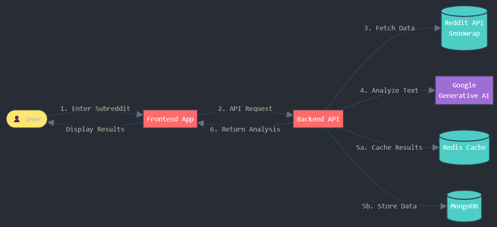

# Remoods: Reddit Subreddit Mood Analyzer

Welcome to **Remoods**, a web application that analyzes the emotional pulse of any subreddit on Reddit. By leveraging Reddit's API and Google's Generative AI (Gemini AI), Remoods provides users with an insightful mood analysis of their favorite subreddits.


## Table of Contents

- [Features](#features)
- [Demo](#demo)
- [Technologies Used](#technologies-used)
- [Architecture](#architecture)
- [Prerequisites](#prerequisites)
- [Installation](#installation)
- [Configuration](#configuration)
- [Running the Application](#running-the-application)
- [Usage](#usage)
- [Project Structure](#project-structure)
- [Contributing](#contributing)
- [License](#license)
- [Acknowledgements](#acknowledgements)

## Features

- **Subreddit Mood Analysis**: Get the current mood and a detailed explanation of any subreddit.
- **Caching**: Uses Redis for caching daily analyses to improve performance.
- **Database Storage**: Stores mood analyses in MongoDB for historical data.
- **Interactive UI**: A sleek, modern frontend built with React and Tailwind CSS.
- **Animated Background**: An immersive starfield background to enhance user experience.

## Demo

Check out the live demo: [Remoods Live](https://remoods.vercel.app/)

## Technologies Used

### Backend

- **Node.js & Express**: Server-side runtime and web framework.
- **MongoDB**: NoSQL database for storing mood analyses.
- **Redis**: In-memory data structure store for caching.
- **Snoowrap**: Reddit API wrapper for Node.js.
- **Google Generative AI (Gemini AI)**: For mood analysis using natural language processing.

### Frontend

- **React**: JavaScript library for building user interfaces.
- **Tailwind CSS**: Utility-first CSS framework.
- **Axios**: Promise-based HTTP client.

## Architecture



1. **User Interaction**: The user inputs a subreddit name on the frontend.
2. **API Request**: The frontend sends a request to the backend API.
3. **Data Retrieval**: The backend fetches subreddit data from Reddit using Snoowrap.
4. **Mood Analysis**: The text data is sent to Google Generative AI for mood analysis.
5. **Caching & Storage**: Results are cached in Redis and stored in MongoDB.
6. **Response**: The backend sends the mood analysis back to the frontend for display.

## Prerequisites

- **Node.js** (v14 or later)
- **npm** or **yarn**
- **MongoDB** instance
- **Redis** instance
- **Google Generative AI API Key**
- **Reddit API Credentials**

## Installation

### Clone the Repository

```bash
git clone https://github.com/pp00x/remoods.git
cd remoods
```

### Install Backend Dependencies

```bash
cd backend
npm install
```

### Install Frontend Dependencies

```bash
cd ../frontend
npm install
```

## Configuration

### Backend Environment Variables

Create a `.env` file in the `backend` directory with the following content:

```env
PORT=5000
MONGODB_URI=your_mongodb_connection_string
REDIS_HOST=localhost
REDIS_PORT=6379
REDIS_PASSWORD=your_redis_password

REDDIT_USER_AGENT=your_reddit_user_agent
REDDIT_CLIENT_ID=your_reddit_client_id
REDDIT_CLIENT_SECRET=your_reddit_client_secret
REDDIT_REFRESH_TOKEN=your_reddit_refresh_token

GOOGLE_GENERATIVE_AI_API_KEY=your_google_generative_ai_api_key
```

### Frontend Environment Variables

Create a `.env` file in the `frontend` directory with the following content:

```env
REACT_APP_API_URL=http://localhost:5000/api/mood
```

## Running the Application

### Start the Backend Server

```bash
cd backend
npm start
```

### Start the Frontend Server

In a new terminal window:

```bash
cd frontend
npm start
```

The frontend will be available at `http://localhost:3000`.

## Usage

1. Open the application in your browser.
2. Enter the name of a subreddit you wish to analyze.
3. Click on **Analyze Mood**.
4. View the mood analysis and explanation.

## Project Structure

```bash
remoods/
├── backend/
│   ├── config/
│   │   ├── db.js
│   │   └── redisClient.js
│   ├── controllers/
│   │   └── moodController.js
│   ├── models/
│   │   └── Mood.js
│   ├── routes/
│   │   └── moodRoutes.js
│   ├── server.js
│   └── package.json
├── frontend/
│   ├── src/
│   │   ├── components/
│   │   ├── services/
│   │   ├── styles/
│   │   ├── App.js
│   │   └── index.js
│   ├── public/
│   ├── tailwind.config.js
│   └── package.json
├── assets/
│   └── architecture.png
└── README.md
```

## Contributing

Contributions are welcome! Please open an issue or submit a pull request for any improvements.

## License

This project is licensed under the [Apache-2.0](LICENSE).

## Acknowledgements

- **Prashant Patil**: Original creator of Remoods.
- **Snoowrap**: Reddit API wrapper for Node.js.
- **Google Generative AI**: For providing the natural language processing capabilities.
- **Tailwind CSS**: For the amazing utility-first CSS framework.

---

Made with ❤️ by Prashant Patil